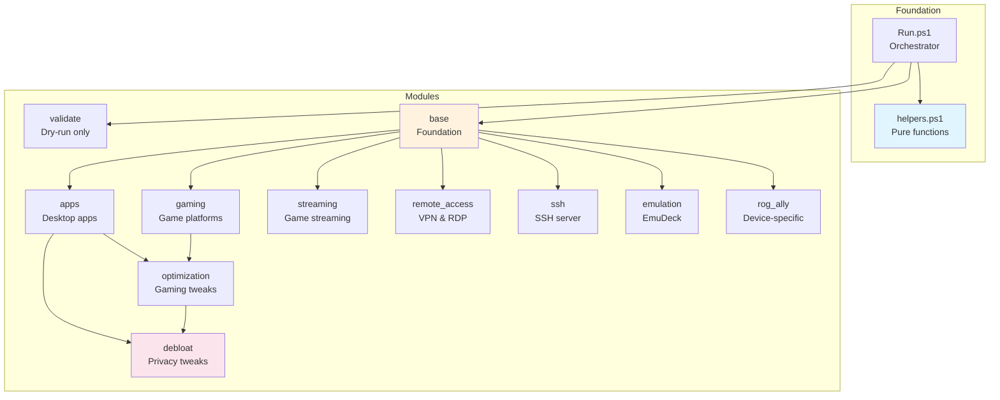

# ROG Ally Module Reference

> Module dependencies, load order, and re-run safety for Bootible ROG Ally configuration.

## Quick Reference

| Module | Depends On | Idempotent | Re-run Safe |
|--------|-----------|------------|-------------|
| validate | - | Yes | Yes (dry-run only) |
| base | - | Yes | Yes |
| apps | base | Yes | Yes |
| gaming | base | Yes | Yes |
| streaming | base | Yes | Yes |
| remote_access | base | Yes | Yes |
| ssh | base, (apps for PS7) | Yes | Yes |
| emulation | base | Yes | Yes |
| rog_ally | base | Yes | Yes |
| optimization | base, (gaming for Steam) | Yes | Yes |
| debloat | all prior modules | Yes | Yes |

**All modules are idempotent and safe to re-run.** Running Bootible multiple times will not cause issues.

---

## Dependency Graph



---

## Load Order

Modules execute in this fixed order (defined in `Run.ps1`):

```
1. helpers.ps1    [Library - always loaded first]
2. validate       [Dry-run only - package validation]
3. base           [Foundation - hostname, network, winget]
4. apps           [Desktop applications]
5. gaming         [Game platforms & launchers]
6. streaming      [Game streaming clients]
7. remote_access  [VPN & remote desktop]
8. ssh            [SSH server configuration]
9. emulation      [EmuDeck setup]
10. rog_ally      [Device-specific tools]
11. optimization  [Windows gaming tweaks]
12. debloat       [Privacy & performance tweaks]
```

**Why this order matters:**
- `base` initializes winget sources before any package installs
- `apps` installs PS7 which `ssh` and `debloat` can configure
- `optimization` configures Steam settings (requires Steam from `gaming`)
- `debloat` runs last to configure all installed applications

---

## Module Details

### helpers.ps1

**Type:** Library (not a module)
**Location:** `lib/helpers.ps1`
**Dependencies:** None

Pure functions with no side effects, safe to import for testing:
- `Merge-Configs` - Recursively merge configuration hashtables
- `Get-ConfigValue` - Get nested config values with dot notation
- `Convert-OrderedDictToHashtable` - Convert YAML output to hashtable

### validate

**Purpose:** Pre-flight validation of all winget package IDs
**Dependencies:** None
**Runs:** Dry-run mode only

Validates that all package IDs in the configuration exist in winget sources before installation. Reports which packages are available and which are missing.

**Idempotency:** Yes - read-only, no system changes
**Re-run Safety:** Yes - only runs in dry-run mode

### base

**Purpose:** System foundation and prerequisites
**Dependencies:** None (foundation module)
**Config Keys:** `hostname`, `static_ip`, `package_managers`, `optimize_winget`

Sets up:
- Hostname configuration
- Static IP or DHCP network settings
- Package managers (Chocolatey, Scoop) if enabled
- Winget source optimization
- Essential utilities (7-Zip, Everything, PowerToys)
- Windows Terminal verification

**Idempotency:** Yes
- Hostname: skips if already set
- Network: checks current state before changing
- Package managers: checks if already installed
- Utilities: winget skips installed packages

**Re-run Safety:** Yes - all operations check state first

### apps

**Purpose:** Desktop application installation
**Dependencies:** base (winget initialized)
**Config Keys:** `install_*` for each application category

Installs applications by category:
- Utilities (7-Zip, Everything, PowerToys, PowerShell 7)
- Communication (Discord, Signal)
- Media (VLC, Spotify)
- Browsers (Firefox, Chrome, Edge)
- Productivity (OBS, VS Code)
- VPN (Tailscale, ProtonVPN)
- Password managers (1Password, Bitwarden, KeePassXC)
- Development tools (Git, Python, Node.js, Java)
- System utilities (Revo Uninstaller, CCleaner, WizTree)
- Runtimes (.NET, VC++, DirectX)

**Idempotency:** Yes - winget checks installation status before each install
**Re-run Safety:** Yes - skips already-installed packages

### gaming

**Purpose:** Gaming platforms and utilities
**Dependencies:** base (winget initialized)
**Config Keys:** `install_gaming`, `install_steam`, `install_playnite`, etc.

Installs:
- Game platforms (Steam, GOG Galaxy, Epic, EA, Ubisoft, Amazon)
- Battle.net (special handling - non-standard installer)
- Launchers (Playnite)
- Controller utilities (DS4Windows)
- Mod managers (Vortex)

**Idempotency:** Yes - checks installation before each package
**Re-run Safety:** Yes - skips installed platforms

### streaming

**Purpose:** Game streaming clients
**Dependencies:** base (winget initialized)
**Config Keys:** `install_streaming`, `install_moonlight`, `install_chiaki`, etc.

Installs:
- Local streaming (Moonlight, Parsec, Steam Link)
- Console streaming (Chiaki-ng for PlayStation)
- Cloud gaming (Xbox App, GeForce NOW)

**Idempotency:** Yes - checks installation status
**Re-run Safety:** Yes - skips installed clients

### remote_access

**Purpose:** VPN and remote desktop tools
**Dependencies:** base (winget initialized)
**Config Keys:** `install_remote_access`, `install_tailscale`, `enable_rdp`, etc.

Installs/configures:
- VPN (Tailscale)
- Remote desktop (AnyDesk, RustDesk)
- Windows RDP (enables if configured)

**Idempotency:** Yes
- Applications: checks before install
- RDP: checks registry state before enabling

**Re-run Safety:** Yes

### ssh

**Purpose:** Windows OpenSSH server configuration
**Dependencies:** base (network), apps (optional - PS7 for PSRemoting)
**Config Keys:** `install_ssh`, `ssh_server_enable`, `ssh_authorized_keys`

Configures:
- OpenSSH client/server installation
- SSH service startup type
- Authorized keys import from private repo
- PSRemoting over SSH (if PS7 installed)
- Firewall rules for SSH and ICMP

**Idempotency:** Yes
- OpenSSH: checks Windows capability state
- Services: checks running state
- Firewall: checks existing rules

**Re-run Safety:** Yes - updates authorized keys, preserves service state

### emulation

**Purpose:** EmuDeck installation
**Dependencies:** base (winget initialized)
**Config Keys:** `install_emulation`

Installs EmuDeck for emulator management:
- Checks for existing EmuDeck installation
- Uses EA (Patreon) installer from private repo if available
- Falls back to public installer

**Idempotency:** Yes - checks installation paths before running
**Re-run Safety:** Yes - skips if already installed

### rog_ally

**Purpose:** ASUS ROG Ally-specific tools
**Dependencies:** base (winget initialized)
**Config Keys:** `install_rog_ally`, `install_handheld_companion`, `install_rtss`, etc.

Installs/checks:
- Armoury Crate (verification - usually pre-installed)
- MyASUS / ASUS PC Assistant
- Handheld Companion (alternative controller mapper)
- Performance monitoring (RTSS, HWiNFO, MSI Afterburner)
- Hardware info (CPU-Z, GPU-Z)
- AMD Adrenalin detection

**Idempotency:** Yes - checks installation status
**Re-run Safety:** Yes - skips installed tools

### optimization

**Purpose:** Windows gaming optimizations
**Dependencies:** base, gaming (for Steam settings)
**Config Keys:** `enable_game_mode`, `disable_game_dvr`, `disable_core_isolation`, etc.

Configures:
- Windows Game Mode
- Hardware-accelerated GPU Scheduling
- Game DVR / Xbox Game Bar settings
- Core Isolation (optional - security trade-off)
- Virtual Machine Platform (optional)
- BitLocker (optional)
- AMD Vari-Bright
- Steam settings (Big Picture mode, guide button)
- System maintenance (disk cleanup, time sync)

**Idempotency:** Yes - registry settings are idempotent
**Re-run Safety:** Yes - setting same value has no effect

### debloat

**Purpose:** Privacy and performance tweaks
**Dependencies:** All prior modules (runs last)
**Config Keys:** `install_debloat`, `disable_telemetry`, `disable_copilot`, etc.

Configures:
- Privacy (telemetry, activity history, location tracking, Copilot)
- UI (lock screen ads, classic right-click, Bing search, file extensions)
- Edge debloating
- Network (IPv4 preference, Teredo)
- Performance (fullscreen optimizations, services)
- PowerShell 7 as default terminal
- Personalization (wallpaper, lock screen)
- Desktop cleanup

**Idempotency:** Yes - all registry changes are idempotent
**Re-run Safety:** Yes - creates scheduled task for UCPD-protected keys

---

## Re-run Considerations

### Safe Operations (no user impact on re-run)
- Package installations (winget skips installed packages)
- Registry value settings (same value = no change)
- Service configuration (checks state first)
- Firewall rules (checks for existing rules)

### Operations with Minor Effects on Re-run
- **Wallpaper/lock screen**: Re-copies images, refreshes settings
- **Desktop shortcuts**: Re-cleans desktop (removes any new shortcuts)
- **Scheduled task for UCPD keys**: Re-creates task (old one deleted first)

### Operations That Check Before Acting
- **Hostname**: Only changes if different from desired
- **Static IP**: Only changes if not already configured
- **EmuDeck**: Only runs installer if not detected
- **OpenSSH**: Only installs if capability not present

---

## Selective Module Execution

Run specific modules using the `-Tags` parameter:

```powershell
# Run only base and apps
.\Run.ps1 -Tags base,apps

# Run only gaming-related modules
.\Run.ps1 -Tags gaming,streaming,emulation

# Dry run specific modules
.\Run.ps1 -Tags optimization,debloat -DryRun
```

**Note:** Dependencies are NOT automatically included. Running `-Tags apps` without `base` may fail if winget sources aren't initialized.

---

## Module Disable Options

Each module can be disabled via configuration:

```yaml
# config.yml - disable specific modules
install_apps: false
install_gaming: false
install_streaming: false
install_remote_access: false
install_ssh: false
install_emulation: false
install_rog_ally: false
install_optimization: false
install_debloat: false
```

The `validate` module only runs in dry-run mode and cannot be disabled.

---

## Troubleshooting

### Module didn't run
1. Check if module is enabled in config (`install_<module>: true`)
2. Check if running with `-Tags` and module is included
3. Review transcript log for skip messages

### Package install failed
1. Run in dry-run mode first to validate package IDs
2. Check winget sources: `winget source list`
3. Try running `winget source reset --force`

### Registry changes not applied
1. Some HKCU keys require non-elevated context
2. `debloat` creates a scheduled task for UCPD-protected keys
3. Log out and back in to apply scheduled task changes

### SSH not working
1. Verify SSH server is running: `Get-Service sshd`
2. Check firewall: `Get-NetFirewallRule -DisplayName "*SSH*"`
3. Verify authorized_keys permissions in `C:\ProgramData\ssh\`
