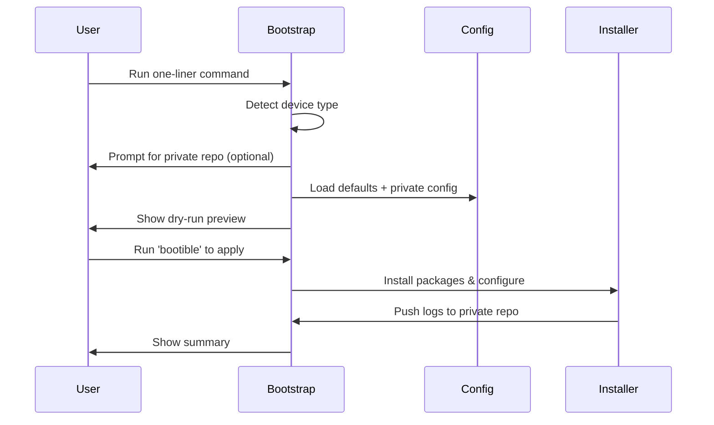

# Getting Started

Welcome to Bootible! This guide will walk you through setting up your gaming handheld from scratch.

## Choose Your Path

-   :material-rocket-launch:{ .lg .middle } **Quick Start**

    ---

    Jump straight in with the one-liner command. Perfect if you just want to see what Bootible does.

    [:octicons-arrow-right-24: Quick Start](quick-start.md)

-   :material-walk:{ .lg .middle } **First Run Walkthrough**

    ---

    Step-by-step guide through your first Bootible run with explanations of each stage.

    [:octicons-arrow-right-24: First Run](first-run.md)

-   :material-lock:{ .lg .middle } **Private Configuration**

    ---

    Set up your own private GitHub repo to store and sync your personal configuration.

    [:octicons-arrow-right-24: Private Config](private-config.md)

-   :material-devices:{ .lg .middle } **Multi-Device Setup**

    ---

    Configure multiple devices (handhelds, PCs) from a single config repository.

    [:octicons-arrow-right-24: Multi-Device](multi-device.md)

---

## Prerequisites

Before running Bootible, make sure you have:

=== "Steam Deck"

    - [x] Steam Deck with internet connection
    - [x] Desktop Mode access (hold power button → Switch to Desktop, or press Steam button → Power → Switch to Desktop)
    - [x] Sudo password set — from Desktop Mode, open Konsole and run `passwd` to set your password

        !!! tip "Save your password"
            Store this password in your password manager of choice. You'll need it when running Bootible.

    - [ ] *Optional:* GitHub account for private config

=== "ROG Ally"

    - [x] ROG Ally with Windows 11 and internet
    - [x] PowerShell running as Administrator
    - [x] Windows Terminal installed (comes with Windows 11)
    - [ ] *Optional:* GitHub account for private config

---

## What Happens When You Run Bootible

1. **Detection** — Bootible identifies your device type
2. **Configuration** — Loads defaults and merges your customizations
3. **Preview** — Shows exactly what will change (dry-run)
4. **Apply** — Installs packages and applies settings
5. **Log** — Pushes run logs to your private repo

---

## Frequently Asked Questions

??? question "Is it safe to run?"
    Yes! Bootible runs in **dry-run mode** by default. The first run shows you exactly what would happen without making any changes. Only when you run `bootible` afterward are changes applied.

    Additionally:

    - **Windows**: Creates a System Restore Point before making changes
    - **Steam Deck**: Creates a btrfs snapshot before making changes

??? question "Do I need a GitHub account?"
    No, GitHub is optional. Without it:

    - You can still run Bootible with default settings
    - Logs are saved locally instead of pushed to a repo
    - You miss out on syncing configs across devices

    With a GitHub account:

    - Store your personal configuration in a private repo
    - Sync settings across multiple devices
    - Run logs are automatically pushed for debugging

??? question "Can I undo changes?"
    Yes!

    - **Windows**: Use System Restore to revert to the pre-Bootible state
    - **Steam Deck**: Restore from the btrfs snapshot created before running

??? question "What if I run it multiple times?"
    Bootible is **idempotent** — running it multiple times is safe. It will:

    - Skip packages already installed
    - Update configurations if they've changed
    - Not duplicate any settings
