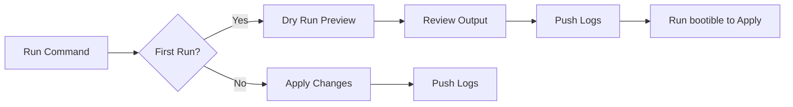

# Bootible

**One-liner setup for gaming handhelds.**

Bootible automates the configuration of Steam Deck, ROG Ally, Android handhelds, and other gaming devices with a single command. Preview everything before applying, customize via your own private config, and re-run anytime to sync your setup.

<div class="grid cards" markdown>

-   :material-lightning-bolt:{ .lg .middle } **Quick Start**

    ---

    Get your device configured in minutes with a single command.

    [:octicons-arrow-right-24: Get started](getting-started/quick-start.md)

-   :material-cog:{ .lg .middle } **Configuration**

    ---

    Customize every aspect of your setup with simple YAML.

    [:octicons-arrow-right-24: Configure](configuration/index.md)

-   :material-controller:{ .lg .middle } **Features**

    ---

    Game streaming, emulation, remote access, and more.

    [:octicons-arrow-right-24: Explore features](features/index.md)

-   :material-book-open-page-variant:{ .lg .middle } **Reference**

    ---

    Complete documentation for every option and command.

    [:octicons-arrow-right-24: Read the docs](reference/index.md)

</div>

---

## Supported Devices

=== "Steam Deck"

    ```bash
    curl -fsSL https://bootible.dev/deck | bash
    ```

    **SteamOS / Arch Linux** — Ansible-based configuration with Flatpak apps, Decky plugins, emulation, and more.

=== "ROG Ally"

    ```powershell
    irm https://bootible.dev/rog | iex
    ```

    **Windows 11** — PowerShell-based setup with winget packages, gaming optimizations, debloat options, and streaming tools.

=== "Android (ALPHA)"

    ```bash
    curl -fsSL https://bootible.dev/android | bash
    ```

    **Android 11+** — Wireless ADB provisioning from your computer. Install APKs, configure settings, and push files to Retroid Pocket, AYANEO, Odin, and other Android handhelds.

---

## How It Works



1. **Dry Run by Default** — First run previews all changes without applying them
2. **Review** — See exactly what will be installed and configured
3. **Logs Pushed** — Run logs are always pushed to your private repo
4. **Apply** — Run `bootible` to apply your configuration

---

## Key Features

<div class="grid" markdown>

:material-shield-check:{ .feature-icon } **Safe by Default**
:   Runs in preview mode first. Creates restore points (Windows) and btrfs snapshots (Steam Deck) before making changes.

:material-lock:{ .feature-icon } **Private Configuration**
:   Your settings live in your own GitHub repo. No data is collected or stored.

:material-sync:{ .feature-icon } **Idempotent**
:   Run as many times as you want. Only changes what's needed.

:material-devices:{ .feature-icon } **Multi-Device**
:   Manage multiple devices from a single private config repo.

:material-package-variant:{ .feature-icon } **Batteries Included**
:   100+ apps and tools available. Streaming, emulation, password managers, and more.

:material-source-branch:{ .feature-icon } **Open Source**
:   MIT licensed. Audit the code, fork it, contribute back.

</div>

---

## What Gets Installed

!!! tip "Everything is opt-in"
    Nothing is installed unless you enable it in your configuration.

### Applications

| Category | Examples |
|----------|----------|
| **Communication** | Discord, Signal, Telegram, Slack |
| **Media** | Spotify, VLC, Plex, Jellyfin |
| **Browsers** | Firefox, Chrome, Chromium |
| **Productivity** | VS Code, OBS, LibreOffice |
| **Gaming** | Steam, GOG Galaxy, Epic, Playnite |
| **Streaming** | Moonlight, Chiaki, Parsec, Greenlight |
| **Emulation** | EmuDeck, RetroArch, standalone emulators |
| **Utilities** | 7-Zip, Everything, PowerToys |

### System Configuration

| Feature | Windows | Steam Deck |
|---------|:-------:|:----------:|
| Restore points / Snapshots | :material-check: | :material-check: |
| Static IP configuration | :material-check: | :material-check: |
| SSH server & key management | :material-check: | :material-check: |
| Tailscale VPN | :material-check: | :material-check: |
| Gaming optimizations | :material-check: | :material-check: |
| Debloat & privacy | :material-check: | — |
| Decky Loader & plugins | — | :material-check: |

---

## Community

<div class="grid cards" markdown>

-   :fontawesome-brands-github:{ .lg .middle } **GitHub**

    ---

    Report issues, request features, and contribute.

    [:octicons-arrow-right-24: Repository](https://github.com/bootible/bootible)

-   :fontawesome-brands-discord:{ .lg .middle } **Discord**

    ---

    Chat with other users and get help.

    [:octicons-arrow-right-24: Join Discord](https://discord.gg/bootible)

</div>

---

## License

Bootible is open source software licensed under the [MIT License](https://github.com/bootible/bootible/blob/main/LICENSE).
