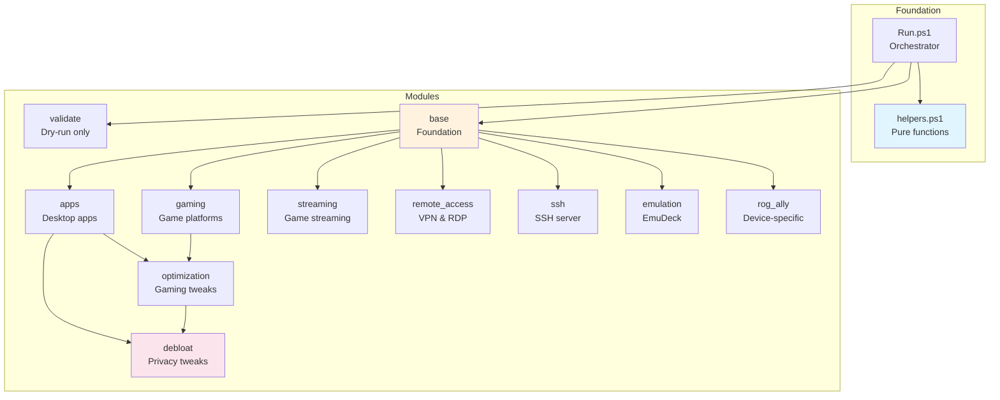

# ROG Ally PowerShell Modules

Bootible uses a modular PowerShell architecture to configure your ROG Ally. Each module handles a specific aspect of the setup.

---

## Module Overview

| Module | Depends On | Description |
|--------|-----------|-------------|
| **validate** | - | Dry-run package validation |
| **base** | - | Hostname, network, winget setup |
| **apps** | base | Desktop applications |
| **gaming** | base | Game platforms & launchers |
| **streaming** | base | Game streaming clients |
| **remote_access** | base | VPN & remote desktop |
| **ssh** | base | SSH server configuration |
| **emulation** | base | EmuDeck setup |
| **rog_ally** | base | Device-specific tools |
| **optimization** | base, gaming | Gaming tweaks |
| **debloat** | all | Privacy & performance |

**All modules are idempotent and safe to re-run.**

---

## Dependency Graph



---

## Load Order

Modules execute in this fixed order:

```
1. helpers.ps1    # Library - always loaded first
2. validate       # Dry-run only - package validation
3. base           # Foundation - hostname, network, winget
4. apps           # Desktop applications
5. gaming         # Game platforms & launchers
6. streaming      # Game streaming clients
7. remote_access  # VPN & remote desktop
8. ssh            # SSH server configuration
9. emulation      # EmuDeck setup
10. rog_ally      # Device-specific tools
11. optimization  # Windows gaming tweaks
12. debloat       # Privacy & performance tweaks
```

**Why this order matters:**

- `base` initializes winget before any package installs
- `apps` installs PowerShell 7 which `ssh` and `debloat` can use
- `optimization` configures Steam settings (requires Steam from `gaming`)
- `debloat` runs last to configure all installed applications

---

## validate

**Purpose:** Pre-flight validation of all winget package IDs

**Runs:** Dry-run mode only

Validates that all package IDs in the configuration exist in winget sources. Reports which packages are available and which are missing.

**Example Output:**

```
Validating packages...
  ✓ Discord.Discord
  ✓ Spotify.Spotify
  ✗ Invalid.PackageID - Not found in winget
```

---

## base

**Purpose:** System foundation and prerequisites

**Config Keys:**

| Key | Type | Default | Description |
|-----|------|---------|-------------|
| `hostname` | string | - | System hostname |
| `static_ip.enabled` | bool | `false` | Enable static IP |
| `static_ip.interface` | string | `Ethernet` | Network adapter |
| `static_ip.address` | string | - | IP address |
| `static_ip.prefix_length` | int | `24` | Subnet prefix |
| `static_ip.gateway` | string | - | Default gateway |
| `static_ip.dns` | list | - | DNS servers |
| `package_managers.chocolatey` | bool | `false` | Install Chocolatey |
| `package_managers.scoop` | bool | `false` | Install Scoop |
| `optimize_winget` | bool | `true` | Optimize winget sources |

**What It Does:**

1. Sets hostname if specified
2. Configures static IP or DHCP
3. Installs optional package managers (Chocolatey, Scoop)
4. Optimizes winget source updates
5. Installs essential utilities (7-Zip, Everything, PowerToys)
6. Verifies Windows Terminal is installed

---

## apps

**Purpose:** Desktop application installation

**Master Key:** `install_apps` (default: `true`)

**Application Categories:**

| Category | Config Keys |
|----------|-------------|
| **Utilities** | `install_7zip`, `install_everything`, `install_powertoys`, `install_pwsh` |
| **Communication** | `install_discord`, `install_signal` |
| **Media** | `install_vlc`, `install_spotify` |
| **Browsers** | `install_firefox`, `install_chrome`, `install_edge` |
| **Productivity** | `install_obs`, `install_vscode` |
| **VPN** | `install_tailscale`, `install_protonvpn` |
| **Password Managers** | `password_managers`: list of `1password`, `bitwarden`, `keepassxc` |
| **Development** | `install_git`, `install_python`, `install_nodejs`, `install_java` |
| **System Utilities** | `install_revo`, `install_ccleaner`, `install_wiztree` |
| **Runtimes** | `install_dotnet`, `install_vcredist`, `install_directx` |

**Example:**

```yaml
install_apps: true
install_discord: true
install_spotify: true
password_managers:
  - "1password"
install_pwsh: true  # PowerShell 7
```

---

## gaming

**Purpose:** Gaming platforms and utilities

**Master Key:** `install_gaming` (default: `true`)

**Platforms:**

| Key | Package |
|-----|---------|
| `install_steam` | Valve.Steam |
| `install_gog_galaxy` | GOG.Galaxy |
| `install_epic_games` | EpicGames.EpicGamesLauncher |
| `install_ea_app` | ElectronicArts.EADesktop |
| `install_ubisoft` | Ubisoft.Connect |
| `install_amazon_games` | Amazon.Games |
| `install_battlenet` | (special handling) |
| `install_playnite` | Playnite.Playnite |
| `install_ds4windows` | Ryochan7.DS4Windows |
| `install_vortex` | NexusMods.Vortex |

**Battle.net Note:**

Battle.net uses a non-standard installer. Bootible downloads and launches it; you complete installation manually.

---

## streaming

**Purpose:** Game streaming clients

**Master Key:** `install_streaming` (default: `true`)

| Key | Package | Use Case |
|-----|---------|----------|
| `install_moonlight` | MoonlightGameStreamingProject.Moonlight | NVIDIA GameStream |
| `install_parsec` | Parsec.Parsec | Low-latency streaming |
| `install_chiaki` | streetpea.Chiaki4deck | PlayStation Remote Play |
| `install_steam_link` | Valve.SteamLink | Steam streaming |
| `install_sunshine` | LizardByte.Sunshine | Moonlight host |
| `install_geforcenow` | (manual) | Cloud gaming |

---

## remote_access

**Purpose:** VPN and remote desktop tools

**Master Key:** `install_remote_access` (default: `true`)

| Key | Package | Description |
|-----|---------|-------------|
| `install_tailscale` | tailscale.tailscale | Mesh VPN |
| `install_anydesk` | AnyDesk.AnyDesk | Remote desktop |
| `install_rustdesk` | RustDesk.RustDesk | Open-source remote desktop |
| `enable_rdp` | - | Windows Remote Desktop |

**RDP Configuration:**

When `enable_rdp: true`, Bootible:

1. Enables Remote Desktop in registry
2. Adds firewall rule
3. Enables Network Level Authentication

---

## ssh

**Purpose:** Windows OpenSSH server configuration

**Master Key:** `install_ssh` (default: `true`)

| Key | Type | Default | Description |
|-----|------|---------|-------------|
| `ssh_server_enable` | bool | `true` | Enable SSH server |
| `ssh_import_authorized_keys` | bool | `false` | Import keys from private repo |
| `ssh_authorized_keys` | list | `[]` | Key files to import |

**What It Does:**

1. Installs OpenSSH Client/Server Windows capability
2. Sets sshd service to automatic start
3. Imports authorized keys from `private/ssh-keys/`
4. Configures PSRemoting over SSH (if PowerShell 7 installed)
5. Creates firewall rules for SSH and ICMP

**Key Import:**

```yaml
ssh_import_authorized_keys: true
ssh_authorized_keys:
  - "desktop.pub"
  - "laptop.pub"
```

Keys are read from `private/ssh-keys/` and written to `C:\ProgramData\ssh\administrators_authorized_keys`.

---

## emulation

**Purpose:** EmuDeck installation

**Master Key:** `install_emulation` (default: `false`)

**What It Does:**

1. Checks for existing EmuDeck installation
2. Uses EA (Patreon) installer from private repo if available
3. Falls back to public installer
4. Places shortcut for manual completion

**Patreon Version:**

```
private/scripts/EmuDeck EA Windows.bat
```

---

## rog_ally

**Purpose:** ASUS ROG Ally-specific tools

**Master Key:** `install_rog_ally` (default: `true`)

| Key | Package | Description |
|-----|---------|-------------|
| `install_handheld_companion` | - | Alternative controller mapper |
| `install_rtss` | Guru3D.RTSS | Frame limiter & OSD |
| `install_hwinfo` | REALiX.HWiNFO | Hardware monitoring |
| `install_cpuz` | CPUID.CPU-Z | CPU information |
| `install_gpuz` | TechPowerUp.GPU-Z | GPU information |
| `install_afterburner` | Guru3D.Afterburner | GPU overclocking |

**Armoury Crate:**

Bootible verifies Armoury Crate is present (usually pre-installed) but doesn't modify it.

---

## optimization

**Purpose:** Windows gaming optimizations

**Master Key:** `install_optimization` (default: `true`)

| Key | Type | Default | Description |
|-----|------|---------|-------------|
| `enable_game_mode` | bool | `true` | Windows Game Mode |
| `enable_hardware_gpu_scheduling` | bool | `true` | HAGS |
| `disable_game_dvr` | bool | `true` | Disable Game DVR |
| `disable_xbox_gamebar` | bool | `false` | Disable Game Bar |
| `disable_core_isolation` | bool | `false` | Security trade-off |
| `disable_vbs` | bool | `false` | VBS setting |
| `disable_vari_bright` | bool | `false` | AMD brightness |
| `configure_steam_autostart` | bool | `false` | Auto-start Steam |
| `steam_big_picture_mode` | bool | `false` | Big Picture on start |
| `steam_guide_button` | bool | `true` | Use guide button |

**Security Trade-offs:**

!!! warning "Core Isolation & VBS"
    Disabling Core Isolation or VBS can improve gaming performance but reduces security. Only disable if you understand the implications.

---

## debloat

**Purpose:** Privacy and performance tweaks

**Master Key:** `install_debloat` (default: `true`)

### Privacy Settings

| Key | Default | Description |
|-----|---------|-------------|
| `disable_telemetry` | `true` | Windows telemetry |
| `disable_activity_history` | `true` | Activity tracking |
| `disable_location_tracking` | `false` | Location services |
| `disable_copilot` | `true` | Windows Copilot |

### UI Settings

| Key | Default | Description |
|-----|---------|-------------|
| `classic_right_click_menu` | `true` | Windows 10 context menu |
| `show_file_extensions` | `true` | Show extensions |
| `disable_lock_screen_ads` | `true` | Lock screen suggestions |
| `disable_bing_search` | `true` | Bing in Start menu |

### Edge Debloating

| Key | Default | Description |
|-----|---------|-------------|
| `disable_edge_sidebar` | `true` | Edge sidebar |
| `disable_edge_shopping` | `true` | Shopping features |

### Network

| Key | Default | Description |
|-----|---------|-------------|
| `prefer_ipv4` | `true` | IPv4 over IPv6 |
| `disable_teredo` | `true` | Teredo tunneling |

### Personalization

| Key | Description |
|-----|-------------|
| `wallpaper_path` | Custom wallpaper image |
| `lockscreen_path` | Custom lock screen |

**Image Paths:**

Reference images from your private repo:

```yaml
wallpaper_path: "Images/wallpaper.jpg"
lockscreen_path: "Images/lockscreen.jpg"
```

Images are copied from `private/device/rog-ally/<device>/Images/`.

---

## Selective Module Execution

### Run Specific Modules

```powershell
# Only base and apps
.\Run.ps1 -Tags base,apps

# Only gaming-related
.\Run.ps1 -Tags gaming,streaming,emulation

# Dry run specific modules
.\Run.ps1 -Tags optimization,debloat -DryRun
```

### Skip Modules

```powershell
# Skip debloat
.\Run.ps1 -SkipTags debloat
```

### Dependencies Not Auto-Included

Running `-Tags apps` without `base` may fail if winget sources aren't initialized. Include dependencies manually.

---

## Disabling Modules

Disable modules via configuration:

```yaml
install_apps: false
install_gaming: false
install_streaming: false
install_remote_access: false
install_ssh: false
install_emulation: false
install_rog_ally: false
install_optimization: false
install_debloat: false
```

---

## Re-run Behavior

### Always Safe

- Package installs (winget skips installed)
- Registry settings (same value = no change)
- Service configuration (checks state first)
- Firewall rules (checks existing rules)

### Minor Effects on Re-run

- **Wallpaper/lock screen**: Re-copies images
- **Desktop shortcuts**: Re-cleans desktop
- **UCPD scheduled task**: Re-creates task

### Checks Before Acting

- **Hostname**: Only changes if different
- **Static IP**: Only if not configured
- **EmuDeck**: Only if not detected
- **OpenSSH**: Only if capability not present

---

## Troubleshooting

### Module Didn't Run

1. Check if enabled: `install_<module>: true`
2. Check `-Tags` includes module
3. Review transcript log for skip messages

### Package Install Failed

1. Run dry-run to validate: `.\Run.ps1 -DryRun`
2. Check winget: `winget source list`
3. Reset: `winget source reset --force`

### Registry Changes Not Applied

1. Some HKCU keys need non-elevated context
2. `debloat` creates scheduled task for UCPD keys
3. Log out/in to apply scheduled changes

### SSH Not Working

1. Check service: `Get-Service sshd`
2. Check firewall: `Get-NetFirewallRule -DisplayName "*SSH*"`
3. Check keys: `C:\ProgramData\ssh\administrators_authorized_keys`
