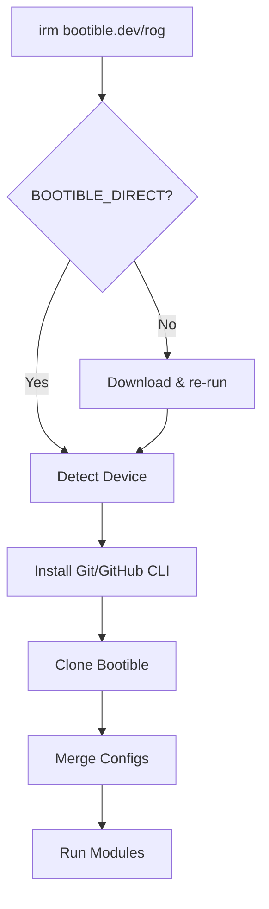
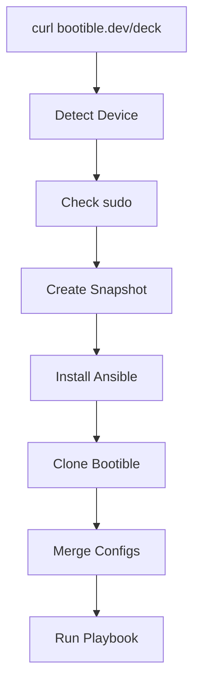
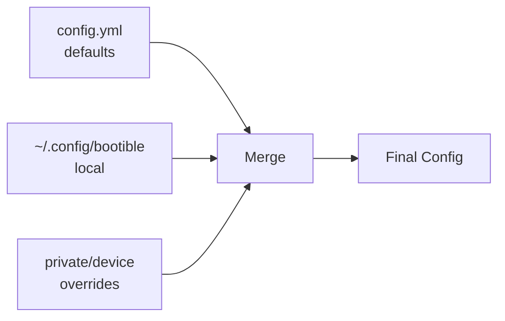
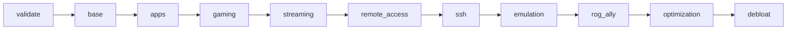
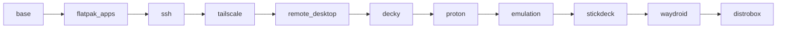
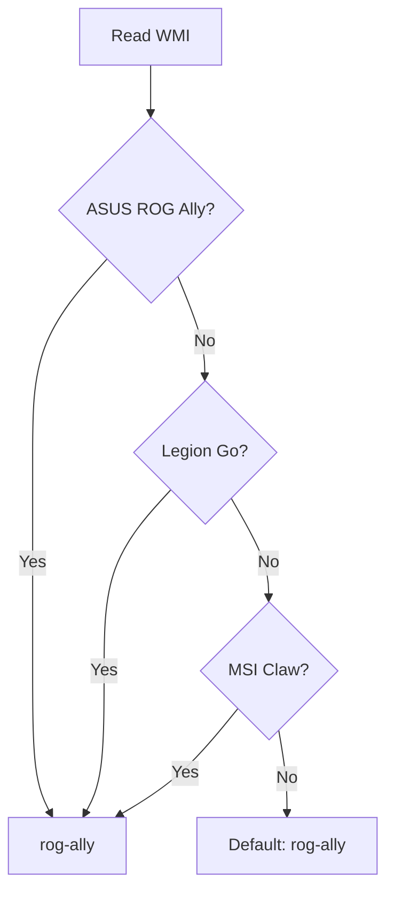
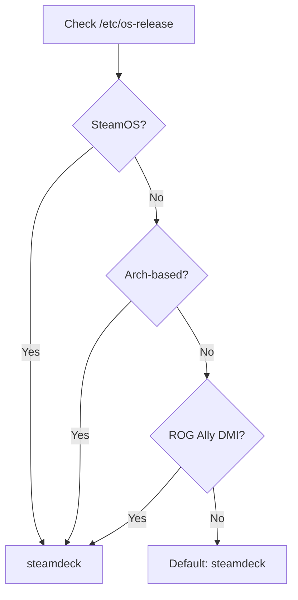

# Bootible Architecture

System diagrams for understanding bootible's bootstrap, configuration, and module flows.

## Bootstrap Flow

How bootible initializes on each platform.

### Windows (ROG Ally)

### Linux (Steam Deck)

## Config Merge Flow

Configuration loading follows a layered override pattern.

**Priority** (highest wins): Private > Local > Defaults

- **Defaults**: `config/<device>/config.yml` - ships with bootible
- **Local**: `~/.config/bootible/<device>/config.yml` - machine-specific
- **Private**: `private/<device>/config.yml` - synced via git

## Module Dependencies

Modules execute in a specific order to ensure dependencies are met.

### Windows Modules

### Steam Deck Roles

## Device Detection Logic

How bootible identifies the target device.

### Windows Detection

### Linux Detection

